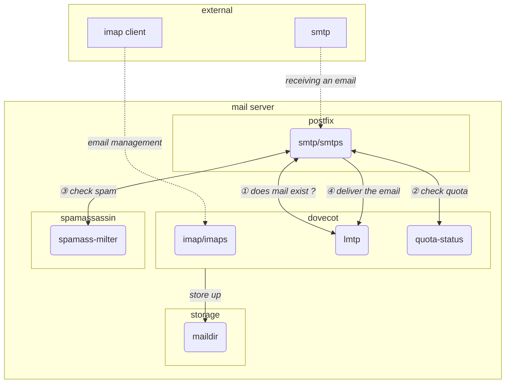

# Installation et configuration d'une plateforme mail (SMTP - IMAP - ANTI-SPAM)

**Table des matière**

- [Installation et configuration d'une plateforme mail (SMTP - IMAP - ANTI-SPAM)](#installation-et-configuration-dune-plateforme-mail-smtp---imap---anti-spam)
   - [Schéma d'interaction entre les différents services](#schéma-dinteraction-entre-les-différents-services)
   - [Création des mailbox](#création-des-mailbox)
      - [Création de l'utilisateur `vmail`](#création-de-lutilisateur-vmail)
      - [Création de boites mails d'exemple](#création-de-boites-mails-dexemple)
      - [Script de mise à jour](#script-de-mise-à-jour)
   - [postfix](#postfix)
      - [Installation](#installation)
      - [Configuration](#configuration)
         - [fichier **`/etc/postfix/master.cf`**](#fichier-etcpostfixmastercf)
         - [fichier **`/etc/aliases`**](#fichier-etcaliases)
         - [fichier **`/etc/postfix/main.cf`**](#fichier-etcpostfixmaincf)
      - [Ajout du fichier de filtrage en fonction des entêtes](#ajout-du-fichier-de-filtrage-en-fonction-des-entêtes)
         - [fichier **`/home/vmail/header_checks`**](#fichier-homevmailheader_checks)
   - [spamassassin](#spamassassin)
      - [Installation](#installation-1)
      - [Configuration](#configuration-1)
      - [Script bayes](#script-bayes)
      - [Pour tester](#pour-tester)
   - [Dovecot (imap - lmtp - sieve)](#dovecot-imap---lmtp---sieve)
      - [Installation](#installation-2)
      - [Configuration](#configuration-2)
         - [authentification](#authentification)
            - [fichier **`/etc/dovecot/conf.d/10-auth.conf`**](#fichier-etcdovecotconfd10-authconf)
            - [fichier **`/etc/dovecot/conf.d/auth-passwdfile.conf.ext`**](#fichier-etcdovecotconfdauth-passwdfileconfext)
         - [mailbox en maildir](#mailbox-en-maildir)
            - [fichier **`/etc/dovecot/conf.d/10-mail.conf`**](#fichier-etcdovecotconfd10-mailconf)
         - [Paramétrage des quotas](#paramétrage-des-quotas)
            - [fichier **`/etc/dovecot/conf.d/20-imap.conf`**](#fichier-etcdovecotconfd20-imapconf)
            - [fichier **`/etc/dovecot/conf.d/90-quota.conf`**](#fichier-etcdovecotconfd90-quotaconf)
         - [Paramétrage `lmtp`](#paramétrage-lmtp)
            - [fichier **`/etc/dovecot/conf.d/10-master.conf`**](#fichier-etcdovecotconfd10-masterconf)
            - [fichier **`/etc/dovecot/conf.d/20-lmtp.conf`**](#fichier-etcdovecotconfd20-lmtpconf)
         - [Paramétrage de `sieve`](#paramétrage-de-sieve)
            - [fichier **`/etc/dovecot/conf.d/90-sieve.conf`**](#fichier-etcdovecotconfd90-sieveconf)
            - [le script `sieve` **`/home/vmail/dovecot.sieve`**](#le-script-sieve-homevmaildovecotsieve)
            - [compilation du script toujours avec l'utilisateur `vmail`](#compilation-du-script-toujours-avec-lutilisateur-vmail)
         - [Configuration SSL](#configuration-ssl)
            - [fichier **`/etc/dovecot/conf.d/10-ssl.conf`**](#fichier-etcdovecotconfd10-sslconf)
         - [Configuration des répertoires spécifiques](#configuration-des-répertoires-spécifiques)
            - [fichier **`/etc/dovecot/conf.d/15-mailboxes.conf`**](#fichier-etcdovecotconfd15-mailboxesconf)
   - [Script de mise à jour de la configuration de postfix](#script-de-mise-à-jour-de-la-configuration-de-postfix)

---

**Les services à installer et à configurer :**

* [SMTP](https://fr.wikipedia.org/wiki/Simple_Mail_Transfer_Protocol) : utilisation de [`postfix`](https://www.postfix.org/) pour la réception de mail virtuel en local uniquement (pas de relais).
* [IMAP](https://fr.wikipedia.org/wiki/Internet_Message_Access_Protocol) : utilisation de [`dovecot`](https://www.dovecot.org/download/) il gérera les boites mails en [`maildir`](http://cr.yp.to/proto/maildir.html).
* [ANTI-SPAM](https://fr.wikipedia.org/wiki/Lutte_anti-spam) : utilisation de [`spamassassin`](https://spamassassin.apache.org/) il utilisera comme filtrage [`bayes`](https://fr.wikipedia.org/wiki/Filtrage_bay%C3%A9sien_du_spam), [`pyzor`](https://www.pyzor.org/en/latest/) et [`razor2`](https://razor.sourceforge.net/)

Le serveur de mails devra avoir une gestion de quota, et un système de filtre en plus de l'anti-spam

Le serveur [SMTP](https://fr.wikipedia.org/wiki/Simple_Mail_Transfer_Protocol) ([`postfix`](https://www.postfix.org/)) enverra les mails locales via le protocole [LMTP](https://fr.wikipedia.org/wiki/Local_Mail_Transfer_Protocol) à l'application [`dovecot`](https://www.dovecot.org/download/) pour les déposer dans les boites mail en [`maildir`](http://cr.yp.to/proto/maildir.html). Il vérifiera s'il s'agit d'un spam en appelant le service [`spamass-milter`](https://savannah.nongnu.org/projects/spamass-milt/)

Les services [`LMTP`](https://fr.wikipedia.org/wiki/), [`quota-status`](https://doc.dovecot.org/2.3/configuration_manual/quota_plugin/#quota-service) et [`spamass-milter`](https://savannah.nongnu.org/projects/spamass-milt/) utiliseront des [`sockets Unix`](https://fr.wikipedia.org/wiki/Berkeley_sockets#Socket_UNIX) pour des raisons de sécurité et de performance.

## Schéma d'interaction entre les différents services



## Création des mailbox

Les mailbox seront stockés au format [`maildir`](http://cr.yp.to/proto/maildir.html) sous l'utilisateur `vmail` dans sa home directory `/home/vmail`

Les fichiers des boîtes mails au format [`maildir`](http://cr.yp.to/proto/maildir.html) seront organisés dans le répertoire `/home/vmail/<domain.tld>/<user>`

La configuration des boites mails (user, password et options) se fera dans un fichier `users` dans le répertoire du domaine (`/home/vmail/<domain.tld>/users`). Fichier au format passwd file.

On pourra également définir des alias via le fichier `/home/vmail/<domain.tld>/alias`

Voir plus bas le chapitre: Création de boites mails d'exemple

### Création de l'utilisateur `vmail`

```bash
sudo groupadd vmail
sudo useradd -g vmail vmail -d /home/vmail/ -s /bin/bash -m
```

### Création de boites mails d'exemple

Création d'un exemple de boites mails `user1@example.tld` et `user2@example.tld` et d'un alias `all@example.tld` sur `user1@example.tld` et `user2@example.tld`.

```bash
$ sudo -iu vmail
$ mkdir example.tld
$ nano example.tld/users
$ cat example.tld/users
# Liste des mailbox de domain.tld avec ses mots de passe et ses options

user1:{PLAIN}mdp1::::::userdb_quota_rule=*:bytes=100K
user2:{PLAIN}mdp2::::::

$ nano example.tld/alias
$ cat example.tld/alias
# Liste de redirection pour le domaine (facultatif)

all user1 user2
```

### Script de mise à jour

[`dovecot`](https://www.dovecot.org/download/) utilisera directement les fichiers `users` pour définir les boites mails avec leurs authentifications (fichier passwd file).

Un script sera présenté en fin de ce document, qui à partir des fichiers `/home/vmail/<domain.tld>/users` et `/home/vmail/<domain.tld>/alias` générera les fichiers `/etc/postfix/vmaildomains` et `/etc/postfix/valias` de [`postfix`](https://www.postfix.org/)

## postfix

version : 3.8.6 (`postconf -d mail_version`)

Référence : 

- site officiel [http://www.postfix.org/](http://www.postfix.org/)
- documentation [Postfix Configuration Parameters](http://www.postfix.org/postconf.5.html)
- autre [Postfix — Wiki Fedora-Fr](https://doc.fedora-fr.org/wiki/Postfix)

### Installation

```bash
sudo -i
DEBIAN_FRONTEND=noninteractive apt -y install postfix
```

### Configuration

#### fichier **`/etc/postfix/master.cf`**

Juste l'ajout de submission (port 537) pour le serveur smtp sécurisé (TLS)

```diff
$ diff -u master.cf{.disabled,}
--- master.cf.disabled    2024-09-19 12:48:04.025990985 +0000
+++ master.cf    2024-09-19 12:48:51.981343634 +0000
@@ -10,6 +10,9 @@
 #               (yes)   (yes)   (no)    (never) (100)
 # ==========================================================================
 smtp      inet  n       -       y       -       -       smtpd
+submission inet n       -       y       -       -       smtpd
+  -o syslog_name=postfix/submission
+  -o smtpd_tls_security_level=encrypt
 #smtp      inet  n       -       y       -       1       postscreen
 #smtpd     pass  -       -       y       -       -       smtpd
 #dnsblog   unix  -       -       y       -       0       dnsblog
```

#### fichier **`/etc/aliases`**

Pour recevoir par mail la supervision de la messagerie

```bash
# See man 5 aliases for format
postmaster: root
root: serge@homeasyweb.net
```

#### fichier **`/etc/postfix/main.cf`**

```diff
$ diff -u main.cf{.disabled,}
--- main.cf.disabled    2024-09-19 12:51:15.393309465 +0000
+++ main.cf    2024-09-22 12:37:30.884960386 +0000
@@ -6,7 +6,7 @@
 # is /etc/mailname.
 #myorigin = /etc/mailname

-smtpd_banner = $myhostname ESMTP $mail_name (Ubuntu)
+#smtpd_banner = $myhostname ESMTP $mail_name (Ubuntu)
 biff = no

 # appending .domain is the MUA's job.
@@ -24,8 +24,8 @@


 # TLS parameters
-smtpd_tls_cert_file=/etc/ssl/certs/ssl-cert-snakeoil.pem
-smtpd_tls_key_file=/etc/ssl/private/ssl-cert-snakeoil.key
+#smtpd_tls_cert_file=/etc/ssl/certs/ssl-cert-snakeoil.pem
+#smtpd_tls_key_file=/etc/ssl/private/ssl-cert-snakeoil.key
 smtpd_tls_security_level=may

 smtp_tls_CApath=/etc/ssl/certs
@@ -34,14 +34,56 @@


 smtpd_relay_restrictions = permit_mynetworks permit_sasl_authenticated defer_unauth_destination
-myhostname = hew2.homeasyweb.net
+myhostname = mail.homeasyweb.net
 alias_maps = hash:/etc/aliases
 alias_database = hash:/etc/aliases
 myorigin = /etc/mailname
-mydestination = $myhostname, hew2.homeasyweb.net, localhost.homeasyweb.net, , localhost
-relayhost = 
+mydestination = $myhostname, mail.homeasyweb.net, localhost.homeasyweb.net, , localhost
+#relayhost = 
 mynetworks = 127.0.0.0/8 [::ffff:127.0.0.0]/104 [::1]/128
-mailbox_size_limit = 0
+#mailbox_size_limit = 0
 recipient_delimiter = +
 inet_interfaces = all
 inet_protocols = all
+
+## Configuration spécifique ##
+
+# pas de relay
+relay_transport = error
+
+# modif de la banner (plus sécu)
+smtpd_banner = $myhostname ESMTP (courriels)
+
+# Gestion des boites aux lettres virtuelles
+virtual_mailbox_domains = /etc/postfix/vmaildomains
+virtual_alias_maps = hash:/etc/postfix/valias
+virtual_mailbox_limit = 1073741824
+virtual_transport = lmtp:unix:private/dovecot-lmtp
+
+# limite à 1go par défaut et 10mo le message
+mailbox_size_limit = 1073741824
+message_size_limit = 10485760
+
+# Certificat ssl
+smtpd_tls_cert_file=/etc/letsencrypt/live/mail.homeasyweb.net/fullchain.pem
+smtpd_tls_key_file=/etc/letsencrypt/live/mail.homeasyweb.net/privkey.pem
+
+# restriction
+smtpd_recipient_restrictions =
+    permit_mynetworks,
+    reject_unauth_destination,
+    # Vérifie l'existance de la boite mail (via lmtp de dovecot)
+    reject_unverified_recipient,
+    # Vérifie le quota de la boite mail (appel quota-status de dovecot)
+    check_policy_service unix:private/dovecot-quota
+
+# blacklist en fonction d'une entete
+header_checks = regexp:/home/vmail/header_checks
+
+# Milter configuration pour appeler spamassassin
+milter_default_action = accept
+smtpd_milters = local:spamass/spamass.sock
+non_smtpd_milters = $smtpd_milters
+milter_connect_macros = b j {daemon_name} {daemon_addr} v _
```

### Ajout du fichier de filtrage en fonction des entêtes

#### fichier **`/home/vmail/header_checks`**

```bash
$ cat header_checks 
# Permet de filtrer en fonction d'une entête

/^Subject:\s+I RECORDED YOU!$/ DISCARD
/^Subject:\s+YOUR DEVICE AND EMAIL HAS BEEN COMPROMISED CHECK THIS MESSAGE NOW!$/ DISCARD
/^From:.*Newsletter.*@brehoulou\.fr/ DISCARD
/^To:.*sales@example\.tld/ DISCARD
```

## spamassassin

version : 4.0.0

On va utiliser avec spamassassin :

* bayes : [Mail::SpamAssassin::Bayes - support for learning classifiers](https://spamassassin.apache.org/full/4.0.x/doc/Mail_SpamAssassin_Bayes.html), la configuration se trouve la : [Mail::SpamAssassin::Conf - SpamAssassin configuration file](https://spamassassin.apache.org/full/4.0.x/doc/Mail_SpamAssassin_Conf.html) avec les paramètres bayes_XXX

* pyzor : [Mail::SpamAssassin::Plugin::Pyzor - perform Pyzor check of messages](https://spamassassin.apache.org/full/4.0.x/doc/Mail_SpamAssassin_Plugin_Pyzor.html)

* razor2 : [Mail::SpamAssassin::Plugin::Razor2 - perform Razor check of messages](https://spamassassin.apache.org/full/4.0.x/doc/Mail_SpamAssassin_Plugin_Razor2.html)

Référence :

* <https://spamassassin.apache.org/>

* Configuration : [Mail::SpamAssassin::Conf - SpamAssassin configuration file](https://spamassassin.apache.org/full/4.0.x/doc/Mail_SpamAssassin_Conf.html)

* [Block Email Spam with Postfix and SpamAssassin Content Filter - LinuxBabe](https://www.linuxbabe.com/mail-server/block-email-spam-check-header-body-with-postfix-spamassassin)

### Installation

```bash
sudo apt -y install spamassassin spamass-milter pyzor razor
```

### Configuration

Créer le répertoire `/home/spamassassin` pour stocker la base de [`bayes`](https://fr.wikipedia.org/wiki/Filtrage_bay%C3%A9sien_du_spam) :

```bash
sudo mkdir /home/spamassassin
sudo chown debian-spamd /home/spamassassin
```

Modifier le fichier `/etc/spamassassin/local.cf` avec le contenu suivant :

```bash
$ cat /etc/spamassassin/local.cf

## Configuration spécifique hew ##

rewrite_header Subject [SPAM _SCORE_]
report_safe 0
bayes_path /home/spamassassin/bayes
pyzor_options --homedir /home/spamassassin
```

Modifier le fichier `/etc/default/spamd` pour ajouter l'utilisateur sous lequel `spamd` doit tourner

```bash
$ cat /etc/default/spamd
# /etc/default/spamd-hew
# Duncan Findlay

# WARNING: please read README.spamd before using.
# There may be security risks.

# Options
# See man spamd for possible options. The -d option is automatically added.

# SpamAssassin uses a preforking model, so be careful! You need to
# make sure --max-children is not set to anything higher than 5,
# unless you know what you're doing.

OPTIONS="--create-prefs --max-children 5 --helper-home-dir -u debian-spamd"

# Pid file
# Where should spamd write its PID to file? If you use the -u or
# --username option above, this needs to be writable by that user.
# Note that this setting is not used when spamd is managed by systemd
PIDFILE="/run/spamd.pid"

# Set nice level of spamd
#NICE="--nicelevel 15"
```

Relancer le service `spamd`

```bash
sudo systemctl restart spamd.service
```

Activer la maintenance de `spamassassin`

```bash
systemctl enable spamassassin-maintenance.timer
```

### Script bayes

Pour l'apprentissage de bayes, on va faire un script à lancer en tant que root en crontab pour qu'il analyse tous les mails et les spams qu'on reçoit.

```bash
$ cat /home/hew/bin/sa-learn.sh 
#!/bin/bash

nbJour=${1:-2}

echo "$(date -Iseconds) : debut de l'apprentissage, $nbJour jours"
for path in $(ls -d /home/vmail/*/*/); do
    user=$(basename $path)
    domain=$(basename $(dirname $path))
    echo -n "$user@$domain"

    nbMail=0
    for mail in $(find /home/vmail/$domain/$user/cur -type f -mtime -${nbJour}); do
        sa-learn --ham $mail >/dev/null
        ((nbMail++))
    done
    echo -n " - $nbMail mails appris"

    nbMail=0
    for mail in $(find /home/vmail/$domain/$user/.Junk/cur -type f -mtime -${nbJour}); do
        sa-learn --spam $mail >/dev/null
        ((nbMail++))
    done
    echo " - $nbMail spam appris"
done
chown debian-spamd:debian-spamd /home/spamassassin/bayes_*
echo "$(date -Iseconds) : fin de l'apprentissage"

$ chmod a+x /home/hew/bin/sa-learn.sh
```

le cron :

```bash
$ sudo cat /etc/cron.d/hew-sa-learn 
# /etc/cron.d/hew-sa-learn: crontab pour l'apprentissage de spamassassin
MAILTO=tech@homeasyweb.net

0 1 * * * root /home/hew/bin/sa-learn.sh
```

### Pour tester

Pour tester on peut utiliser `spamc` et dans le corps d'un mail la chaîne de caractère suivante qui sera considéré comme du spam :

```text
XJS*C4JDBQADN1.NSBN3*2IDNEN*GTUBE-STANDARD-ANTI-UBE-TEST-EMAIL*C.34X
```

Avec un mail non spam :

```bash
$ spamc <<END
> From: from@domain.tld
> To: to@domain.tld
> Subject: test non spam
> 
> Test
> 
> END
X-Spam-Checker-Version: SpamAssassin 4.0.0 (2022-12-13) on hew2.homeasyweb.net
X-Spam-Level: ***
X-Spam-Status: No, score=3.6 required=5.0 tests=BAYES_50,DKIM_ADSP_NXDOMAIN,
    MISSING_DATE,MISSING_MID,NO_RECEIVED,NO_RELAYS autolearn=no
    autolearn_force=no version=4.0.0
From: from@domain.tld
To: to@domain.tld
Subject: test non spam

Test
```

Avec un spam 

```bash
$ spamc <<END
> From: from@domain.tld
> To: to@domain.tld
> Subject: test spam
> 
> Test
> XJS*C4JDBQADN1.NSBN3*2IDNEN*GTUBE-STANDARD-ANTI-UBE-TEST-EMAIL*C.34X
> 
> END
X-Spam-Checker-Version: SpamAssassin 4.0.0 (2022-12-13) on hew2.homeasyweb.net
X-Spam-Flag: YES
X-Spam-Level: **************************************************
X-Spam-Status: Yes, score=1000.9 required=5.0 tests=BAYES_00,
    DKIM_ADSP_NXDOMAIN,GTUBE,MISSING_DATE,MISSING_MID,NO_RECEIVED,
    NO_RELAYS autolearn=no autolearn_force=no version=4.0.0
X-Spam-Report: 
    * -0.0 NO_RECEIVED Informational: message has no Received headers
    *  1.4 MISSING_DATE Missing Date: header
    *  0.5 MISSING_MID Missing Message-Id: header
    *  0.9 DKIM_ADSP_NXDOMAIN No valid author signature and domain not in DNS
    * -1.9 BAYES_00 BODY: Bayes spam probability is 0 to 1%
    *      [score: 0.0080]
    * 1000 GTUBE BODY: Generic Test for Unsolicited Bulk Email
    * -0.0 NO_RELAYS Informational: message was not relayed via SMTP
From: from@domain.tld
To: to@domain.tld
Subject: [SPAM 1000.9] test spam
X-Spam-Prev-Subject: test spam

Test
XJS*C4JDBQADN1.NSBN3*2IDNEN*GTUBE-STANDARD-ANTI-UBE-TEST-EMAIL*C.34X
```

Pour valider que `razor` et `pyzor` fonctionnent, modifier le fichier `/etc/default/spamd` pour ajouter les logs de ces plugins `-D  razor2,pyzor`

```bash
$ cat /etc/default/spamd
# /etc/default/spamd-hew
# Duncan Findlay

# WARNING: please read README.spamd before using.
# There may be security risks.

# Options
# See man spamd for possible options. The -d option is automatically added.

# SpamAssassin uses a preforking model, so be careful! You need to
# make sure --max-children is not set to anything higher than 5,
# unless you know what you're doing.

OPTIONS="--create-prefs --max-children 5 --helper-home-dir -u debian-spamd -D razor2,pyzor"

# Pid file
# Where should spamd write its PID to file? If you use the -u or
# --username option above, this needs to be writable by that user.
# Note that this setting is not used when spamd is managed by systemd
PIDFILE="/run/spamd.pid"

# Set nice level of spamd
#NICE="--nicelevel 15"
```

puis relancer `spamd` :

```bash
sudo systemctl restart spamd.service
```

On doit trouver dans les logs des lignes du style :

```bash
pyzor: network tests on, attempting Pyzor
razor2: razor2 is available, version 2.84
pyzor: adjusting rule PYZOR_CHECK priority to -100
razor2: adjusting rule RAZOR2_CHECK priority to -100
razor2: adjusting rule RAZOR2_CF_RANGE_51_100 priority to -100
zoom: able to use 401/401 'body_0' compiled rules (100%)
pyzor: pyzor is available: /usr/bin/pyzor
pyzor: child process 754479 forked
pyzor: opening pipe: /usr/bin/pyzor --homedir /home/spamassassin check </tmp/.spamassassin7544689HIvnrtmp
razor2: child process 754480 forked
razor2: delaying check_razor2_range call for RAZOR2_CF_RANGE_51_100
pyzor: [754481] finished: exit 1
pyzor: child process 754479 already handled?
razor2: child process 754480 already handled?
spamd: server started on IO::Socket::IP [::1]:783, IO::Socket::IP [127.0.0.1]:783 (running version 4.0.0)
```

puis lancer un test

```bash
$ spamc -R <<END
> From: from@domain.tld
> To: to@domain.tld
> Subject: test non spam
> 
> Test
> 
> END
3.6/5.0
Spam detection software, running on the system "hew2.homeasyweb.net",
has NOT identified this incoming email as spam.  The original
message has been attached to this so you can view it or label
similar future email.  If you have any questions, see
the administrator of that system for details.

Content preview:  Test 

Content analysis details:   (3.6 points, 5.0 required)

 pts rule name              description
---- ---------------------- --------------------------------------------------
 1.4 MISSING_DATE           Missing Date: header
-0.0 NO_RECEIVED            Informational: message has no Received headers
 0.5 MISSING_MID            Missing Message-Id: header
 0.9 DKIM_ADSP_NXDOMAIN     No valid author signature and domain not in DNS
 0.8 BAYES_50               BODY: Bayes spam probability is 40 to 60%
                            [score: 0.5511]
-0.0 NO_RELAYS              Informational: message was not relayed via SMTP
```

On doit trouver dans les logs des lignes du style :

```bash
spamd: connection from ip6-localhost [::1]:46858 to port 783, fd 5
spamd: checking message (unknown) for hew:116
pyzor: pyzor is available: /usr/bin/pyzor
pyzor: child process 754531 forked
pyzor: opening pipe: /usr/bin/pyzor --homedir /home/spamassassin check </tmp/.spamassassin754482JewH7Otmp
razor2: child process 754532 forked
razor2: delaying check_razor2_range call for RAZOR2_CF_RANGE_51_100
pyzor: [754533] finished: exit 1
pyzor: child process 754531 finished, reading results
pyzor: got response: public.pyzor.org:24441\t(200, 'OK')\t28877811\t312096
pyzor: result: COUNT=28877811/5 WELCOMELIST=312096/10/5775562.2
pyzor: result exceeded hardcoded limits, ignoring: count/wl 1000000/10000
razor2: child process 754532 finished, reading results
razor2: part=0 noresponse
razor2: results: spam? 0
spamd: clean message (3.6/5.0) for hew:116 in 1.7 seconds, 70 bytes.
spamd: result: .  3 - BAYES_50,DKIM_ADSP_NXDOMAIN,MISSING_DATE,MISSING_MID,NO_RECEIVED,NO_RELAYS scantime=1.7,size=70,user=hew,uid=116,required_score=5.0,rhost=ip6-localhost,raddr=::1,rport=46858,mid=(unknown),bayes=0.551070,autolearn=no autolearn_force=no
prefork: child states: II
```

ATTENTION : ne pas oublier d'enlever les options de debugage de `spamd` dans `/etc/default/spamd`, option `-D  razor2,pyzor` et de relancer `spamd`

```bash
sudo systemctl restart spamd.service
```

## Dovecot (imap - lmtp - sieve)

version : 2.3.21

Référence :

* site officiel <https://www.dovecot.org/>
* documentation <https://doc.dovecot.org/>
* quota plugins <https://doc.dovecot.org/configuration_manual/quota_plugin/>
* quota configuration <https://doc.dovecot.org/configuration_manual/quota/>
* quota status to Postfix <https://blog.sys4.de/postfix-dovecot-mailbox-quota-en.html>
* exemple de configuration [How to Install Postfix, Dovecot, and Roundcube on Ubuntu 20.04 | Vultr Docs](https://docs.vultr.com/how-to-install-postfix-dovecot-and-roundcube-on-ubuntu-20-04)
* configuration lmtp avec sieve [Postfix and Dovecot LMTP &#8212; Dovecot documentation](https://doc.dovecot.org/2.3/configuration_manual/howto/postfix_dovecot_lmtp/)

Avec dovecot, nous aurons un serveur `imap` et un serveur `lmtp` (`postfix` enverra les mails à dovecot via le protocole `lmtp`) et nous aurons un système de filtre avec `sieve`. Avec ce dernier, on pourra par exemple déplacer automatiquement les spams dans le dossier Junk

### Installation

```bash
sudo apt -y install dovecot-imapd dovecot-lmtpd dovecot-sieve
```

### Configuration

#### authentification

Pour l'authentification, on va autoriser le cryptage du mot de passe en cram-md5 en plus du mot de passe en clair.

Pour la création des comptes imap, On va utiliser des fichiers `passwd-file` avec mot de passe en clair (ce sont les fichiers `/home/vmail/<domain.tld>/users`).

##### fichier **`/etc/dovecot/conf.d/10-auth.conf`**

```diff
$ diff -u 10-auth.conf.disabled 10-auth.conf
--- 10-auth.conf.disabled    2024-09-18 13:38:12.860200832 +0000
+++ 10-auth.conf    2024-09-18 13:38:32.412338672 +0000
@@ -97,7 +97,7 @@
 #   plain login digest-md5 cram-md5 ntlm rpa apop anonymous gssapi otp
 #   gss-spnego
 # NOTE: See also disable_plaintext_auth setting.
-auth_mechanisms = plain
+auth_mechanisms = plain cram-md5

 ##
 ## Password and user databases
@@ -119,9 +119,9 @@
 #!include auth-deny.conf.ext
 #!include auth-master.conf.ext

-!include auth-system.conf.ext
+#!include auth-system.conf.ext
 #!include auth-sql.conf.ext
 #!include auth-ldap.conf.ext
-#!include auth-passwdfile.conf.ext
+!include auth-passwdfile.conf.ext
 #!include auth-checkpassword.conf.ext
 #!include auth-static.conf.ext
```

##### fichier **`/etc/dovecot/conf.d/auth-passwdfile.conf.ext`**

```diff
$ diff -u auth-passwdfile.conf.ext.disabled auth-passwdfile.conf.ext
--- auth-passwdfile.conf.ext.disabled    2024-09-18 13:45:06.146119556 +0000
+++ auth-passwdfile.conf.ext    2024-09-18 13:52:34.476079893 +0000
@@ -5,12 +5,13 @@

 passdb {
   driver = passwd-file
-  args = scheme=CRYPT username_format=%u /etc/dovecot/users
+  args = scheme=PLAIN username_format=%n /home/vmail/%d/users
 }

 userdb {
   driver = passwd-file
-  args = username_format=%u /etc/dovecot/users
+  args = username_format=%n /home/vmail/%d/users
+  default_fields = uid=vmail gid=vmail home=/home/vmail/%d/%n

   # Default fields that can be overridden by passwd-file
   #default_fields = quota_rule=*:storage=1G
```

#### mailbox en maildir

Là on va définir où sont les mailbox et qu'elles sont en maildir, on va en profiter pour ajouter le plugins quota et modifier un paramètre pour la gestion des quotas

##### fichier **`/etc/dovecot/conf.d/10-mail.conf`**

```diff
$ diff -u 10-mail.conf{.disabled,}
--- 10-mail.conf.disabled    2024-09-18 14:04:03.423551655 +0000
+++ 10-mail.conf    2024-09-18 14:10:53.249677793 +0000
@@ -27,7 +27,7 @@
 #
 # <doc/wiki/MailLocation.txt>
 #
-mail_location = mbox:~/mail:INBOX=/var/mail/%u
+mail_location = maildir:/home/vmail/%d/%n

 # If you need to set multiple mailbox locations or want to change default
 # namespace settings, you can do it by defining namespace sections.
@@ -51,6 +51,7 @@
   # Prefix required to access this namespace. This needs to be different for
   # all namespaces. For example "Public/".
   #prefix = 
+  prefix = INBOX.

   # Physical location of the mailbox. This is in same format as
   # mail_location, which is also the default for it.
@@ -111,7 +112,7 @@
 # Group to enable temporarily for privileged operations. Currently this is
 # used only with INBOX when either its initial creation or dotlocking fails.
 # Typically this is set to "mail" to give access to /var/mail.
-mail_privileged_group = mail
+mail_privileged_group = vmail

 # Grant access to these supplementary groups for mail processes. Typically
 # these are used to set up access to shared mailboxes. Note that it may be
@@ -216,6 +217,7 @@
 # Space separated list of plugins to load for all services. Plugins specific to
 # IMAP, LDA, etc. are added to this list in their own .conf files.
 #mail_plugins = 
+mail_plugins = $mail_plugins quota

 ##
 ## Mailbox handling optimizations
@@ -271,6 +273,7 @@
   # the calculation via indexer process. Disabled by default. This setting must
   # be 0 for indexer-worker processes.
   #mail_vsize_bg_after_count = 0
+  mail_vsize_bg_after_count = 100
 }

 ##
```

#### Paramétrage des quotas

On va paramétrer les quotas par défaut (1go avec 100mo de plus pour la corbeille, c'est la conf par défaut).

On va ajouter le service quota-status pour postfix, pour qu'il refuse les mails si le quota est atteint.

##### fichier **`/etc/dovecot/conf.d/20-imap.conf`**

```diff
$ diff -u 20-imap.conf{.disabled,}
--- 20-imap.conf.disabled    2024-09-18 15:27:10.422083417 +0000
+++ 20-imap.conf    2024-09-18 15:29:48.071007736 +0000
@@ -92,6 +92,7 @@
 protocol imap {
   # Space separated list of plugins to load (default is global mail_plugins).
   #mail_plugins = $mail_plugins
+  mail_plugins = $mail_plugins imap_quota

   # Maximum number of IMAP connections allowed for a user from each IP address.
   # NOTE: The username is compared case-sensitively.
```

##### fichier **`/etc/dovecot/conf.d/90-quota.conf`**

```diff
$ diff -u 90-quota.conf{.disabled,}
--- 90-quota.conf.disabled    2024-09-18 15:34:57.216960221 +0000
+++ 90-quota.conf    2024-09-19 15:27:13.363610737 +0000
@@ -17,6 +17,8 @@
 plugin {
   #quota_rule = *:storage=1G
   #quota_rule2 = Trash:storage=+100M
+  quota_rule = *:storage=1G
+  quota_rule2 = Trash:storage=+100M

   # LDA/LMTP allows saving the last mail to bring user from under quota to
   # over quota, if the quota doesn't grow too high. Default is to allow as
@@ -67,6 +69,8 @@
 #   fs: Read-only support for filesystem quota

 plugin {
+  quota = count:User quota
+  quota_vsizes = yes
   #quota = dirsize:User quota
   #quota = maildir:User quota
   #quota = dict:User quota::proxy::quota
@@ -81,3 +85,19 @@
   #quota_rule = *:storage=102400
   #quota2_rule = *:storage=1048576
 }
+
+service quota-status {
+  executable = quota-status -p postfix
+  unix_listener /var/spool/postfix/private/dovecot-quota {
+    user = postfix
+    group = postfix
+    mode = 0600
+  }
+  client_limit = 1
+}
+
+plugin {
+  quota_status_success = DUNNO
+  quota_status_nouser = DUNNO
+  quota_status_overquota = "552 5.2.2 Mailbox is full"
+}
```

#### Paramétrage `lmtp`

On modifie le service pour qu'il écoute via un fichier socket et on le configure.

##### fichier **`/etc/dovecot/conf.d/10-master.conf`**

```diff
$ diff -u 10-master.conf{.disabled,}
--- 10-master.conf.disabled    2024-09-18 15:59:45.733902990 +0000
+++ 10-master.conf    2024-09-18 16:11:44.333171157 +0000
@@ -55,9 +55,15 @@
 }

 service lmtp {
-  unix_listener lmtp {
+  #unix_listener lmtp {
     #mode = 0666
+  #}
+  unix_listener /var/spool/postfix/private/dovecot-lmtp {
+    user = postfix
+    group = postfix
+    mode = 0600
   }
+  user = vmail

   # Create inet listener only if you can't use the above UNIX socket
   #inet_listener lmtp {
```

##### fichier **`/etc/dovecot/conf.d/20-lmtp.conf`**

```diff
$ diff -u 20-lmtp.conf{.disabled,}
--- 20-lmtp.conf.disabled    2023-09-14 13:17:46.000000000 +0000
+++ 20-lmtp.conf    2024-09-18 16:20:35.527351545 +0000
@@ -12,6 +12,7 @@

 # Verify quota before replying to RCPT TO. This adds a small overhead.
 #lmtp_rcpt_check_quota = no
+lmtp_rcpt_check_quota = yes

 # Add "Received:" header to mails delivered.
 #lmtp_add_received_header = yes
@@ -37,4 +38,6 @@
 protocol lmtp {
   # Space separated list of plugins to load (default is global mail_plugins).
   #mail_plugins = $mail_plugins
+  postmaster_address = serge@homeasyweb.net   # required
+  mail_plugins = $mail_plugins quota sieve
 }
```

#### Paramétrage de `sieve`

on aura qu'un script global pour déplacer les spams dans le répertoire Junk

##### fichier **`/etc/dovecot/conf.d/90-sieve.conf`**

```diff
$ diff -u 90-sieve.conf{.disabled,}
--- 90-sieve.conf.disabled    2024-09-18 16:25:15.933504866 +0000
+++ 90-sieve.conf    2024-09-18 16:27:12.742396223 +0000
@@ -36,7 +36,8 @@
   # active script symlink is located.
   # For other types: use the ';name=' parameter to specify the name of the
   # default/active script.
-  sieve = file:~/sieve;active=~/.dovecot.sieve
+  #sieve = file:~/sieve;active=~/.dovecot.sieve
+  sieve = file:/home/vmail;active=/home/vmail/dovecot.sieve

   # The default Sieve script when the user has none. This is the location of a
   # global sieve script file, which gets executed ONLY if user's personal Sieve
```

##### le script `sieve` **`/home/vmail/dovecot.sieve`**

```bash
$ sudo -iu vmail
$ cat dovecot.sieve 

require ["fileinto"];
if header :contains "X-Spam-Flag" "YES" {
  fileinto "INBOX.Junk";
}
```

##### compilation du script toujours avec l'utilisateur `vmail`

```bash
sievec dovecot.sieve
```

#### Configuration SSL

Configuration pour un certificat venant de letsencrypt (certbot)

##### fichier **`/etc/dovecot/conf.d/10-ssl.conf`**

```diff
$ diff -u 10-ssl.conf{.disabled,}
--- 10-ssl.conf.disabled    2024-09-18 16:36:38.897015782 +0000
+++ 10-ssl.conf    2024-09-18 16:38:10.340765273 +0000
@@ -9,8 +9,10 @@
 # dropping root privileges, so keep the key file unreadable by anyone but
 # root. Included doc/mkcert.sh can be used to easily generate self-signed
 # certificate, just make sure to update the domains in dovecot-openssl.cnf
-ssl_cert = </etc/dovecot/private/dovecot.pem
-ssl_key = </etc/dovecot/private/dovecot.key
+#ssl_cert = </etc/dovecot/private/dovecot.pem
+#ssl_key = </etc/dovecot/private/dovecot.key
+ssl_cert = </etc/letsencrypt/live/mail.homeasyweb.net/fullchain.pem
+ssl_key = </etc/letsencrypt/live/mail.homeasyweb.net/privkey.pem

 # If key file is password protected, give the password here. Alternatively
 # give it when starting dovecot with -p parameter. Since this file is often
```

#### Configuration des répertoires spécifiques

##### fichier **`/etc/dovecot/conf.d/15-mailboxes.conf`**

```diff
$ diff -u 15-mailboxes.conf{.disabled,}
--- 15-mailboxes.conf.disabled    2024-09-18 16:41:17.792280899 +0000
+++ 15-mailboxes.conf    2024-09-18 16:42:36.720912470 +0000
@@ -48,21 +48,26 @@
 namespace inbox {
   # These mailboxes are widely used and could perhaps be created automatically:
   mailbox Drafts {
+    auto = subscribe
     special_use = \Drafts
   }
   mailbox Junk {
+    auto = subscribe
     special_use = \Junk
   }
   mailbox Trash {
+    auto = subscribe
     special_use = \Trash
   }

   # For \Sent mailboxes there are two widely used names. We'll mark both of
   # them as \Sent. User typically deletes one of them if duplicates are created.
   mailbox Sent {
+    auto = subscribe
     special_use = \Sent
   }
   mailbox "Sent Messages" {
     special_use = \Sent
   }
```

## Script de mise à jour de la configuration de postfix

**`/home/hew/bin/updatePostfixVmail.sh`**

```bash
$ cat updatePostfixVmail.sh 
#!/bin/bash

vmaildomainsFile=/etc/postfix/vmaildomains
valiasFile=/etc/postfix/valias
echo -e "#\n# File generate by updatePostfixVmailbox\n#\n" | tee $vmaildomainsFile.tmp $valiasFile.tmp >/dev/null

if ls /home/vmail/*/users >/dev/null 2>&1; then
    for usersFile in /home/vmail/*/users; do
        dom=$(echo $usersFile | cut -d/ -f4)
        echo $dom >>$vmaildomainsFile.tmp
    done
fi

if ls /home/vmail/*/alias >/dev/null 2>&1; then
    for aliasFile in /home/vmail/*/alias; do
        dom=$(echo $aliasFile | cut -d/ -f4)
        echo "# $dom" >>$valiasFile.tmp
        awk -v dom=$dom '/^[ \t]*[^# \t]/ {
            indentation = $0
            sub(/\S.*/, "", indentation)
            printf("%s",indentation)

            for(i = 1; i <= NF; i++) {
                withDom = match($i, /@/)
                if (withDom == 0) {
                    printf("%s@%s ", $i, dom)
                } else {
                    printf("%s ", $i)
                }
            }
            printf("\n");
        }' $aliasFile >>$valiasFile.tmp
        echo >>$valiasFile.tmp
    done
fi

mv $vmaildomainsFile{.tmp,}
mv $valiasFile{.tmp,}
postmap $valiasFile
```
